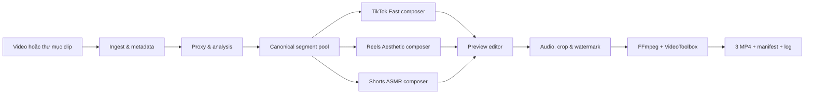

# Kem Timelapse Studio — MVP Design

**Ngày:** 2026-07-18

**Trạng thái:** Đã được người dùng duyệt; sẵn sàng lập kế hoạch triển khai

**Nền tảng đích:** macOS Apple Silicon, Mac M3 Pro từ 24 GB RAM
**Nguồn chuẩn:** iPhone 15 Pro Max, 4K, 30 fps, SDR; một file liên tục hoặc thư mục nhiều clip; tổng thời lượng 1–3 giờ

## 1. Tóm tắt điều hành

Kem Timelapse Studio là ứng dụng desktop chạy hoàn toàn cục bộ. Ứng dụng biến bản quay quá trình vẽ thành một **Content Pack gồm ba video dọc**, mỗi video được dựng riêng cho TikTok, Instagram Reels và YouTube Shorts.

Pipeline đọc metadata, tạo proxy, phân tích hoạt động bằng heuristic, cắt vùng tĩnh, phân loại các đoạn có giá trị, dựng ba timeline, cho phép sửa nhanh trong preview, xử lý ASMR/nhạc, theo dõi canvas để crop 9:16, đóng watermark và render bằng FFmpeg với VideoToolbox.

MVP ưu tiên tính thực dụng trên đúng máy và nguồn quay của người dùng. Hệ thống không huấn luyện model AI, không cần Internet và không chỉnh sửa file nguồn.

## 2. Bằng chứng sản phẩm và điều chỉnh PRD

Ảnh chụp công khai của kênh `@kem12032024` tại thời điểm khảo sát có 14 bài, 12 follower và 81 lượt thích; nhóm video quan sát được nằm khoảng 122–185 lượt xem, trung vị khoảng 134. Các video có yếu tố con người/cá tính cho tín hiệu like/view tốt hơn một số video chỉ quay tác phẩm. Vì không có TikTok Analytics, không thể suy ra retention hoặc nguyên nhân phân phối từ dữ liệu công khai.

Thiết kế vì vậy giữ mục tiêu retention trên 65% như **KPI kinh doanh cần đo sau khi đăng**, không coi đây là cam kết kỹ thuật của renderer. MVP tạo ba biến thể để thử nghiệm hook, nhịp và tỷ lệ ASMR khác nhau từ cùng một tác phẩm.

PRD ban đầu được điều chỉnh như sau:

- Ưu tiên ba output 9:16 sẵn đăng thay vì một output dùng chung cho mọi nền tảng.
- Hoãn output 16:9 4K; đây là tính năng sau MVP.
- Dùng heuristic có thể giải thích và preview sửa được thay vì phụ thuộc model nhận diện cọ/tay.
- Chỉ chạy lọc ồn nặng trên các segment được chọn, không chạy DeepFilterNet trên toàn bộ 1–3 giờ nguồn.
- Hiệu năng là benchmark trên dữ liệu đại diện, không là lời hứa cho mọi recording.

## 3. Mục tiêu và tiêu chí thành công

### 3.1 Mục tiêu người dùng

- Một người vận hành không cần biết FFmpeg/OpenCV có thể đi từ video nguồn đến Content Pack bằng luồng ba bước.
- Video đầu tiên sẵn trong tối đa 15 phút; đủ ba video trong tối đa 20 phút trên máy chuẩn, với recording chuẩn dài tối đa 3 giờ.
- Thao tác sửa đề xuất trong preview không vượt quá 5 phút với artwork đại diện.
- Một lần phân tích phục vụ cả ba output; sửa một variant không làm thay đổi hai variant còn lại trừ khi người dùng chọn “Copy to all”.

### 3.2 Tiêu chí chất lượng benchmark

- Loại ít nhất 80% tổng thời lượng inactivity đã được con người gắn nhãn trong bộ benchmark.
- Giữ ít nhất 90% tổng thời lượng detail quan trọng đã được con người gắn nhãn.
- Không có black gap; lệch audio/video dưới 100 ms.
- Mỗi output qua kiểm tra `ffprobe`: MP4, H.264, AAC, 1080×1920, 30 fps. Variant không có âm thanh hữu ích vẫn chứa một AAC track im lặng để giữ hợp đồng đầu ra đồng nhất.
- File nguồn không bị ghi đè, thay đổi metadata hoặc xóa.

### 3.3 Điều kiện nghiệm thu dữ liệu

Trước khi gọi là MVP đạt chuẩn, chủ sản phẩm phải cung cấp ít nhất một recording hoàn chỉnh thực tế từ iPhone 15 Pro Max. Recording này dùng để khóa threshold heuristic và chạy benchmark end-to-end. Các clip fixture ngắn chỉ đủ cho phát triển, không đủ xác nhận mục tiêu 15/20 phút.

## 4. Phạm vi MVP

### Bao gồm

- Ứng dụng desktop macOS bằng Python 3.10+; PySide6 là UI shell mặc định.
- Nhập một hoặc nhiều file MOV/MP4, xem metadata, sắp xếp lại và bỏ chọn clip.
- Tạo proxy và phân tích video/audio cục bộ.
- Cắt inactivity và tạo canonical segment pool.
- Bốn mức tốc độ hữu hạn: 1×, 2×, 4× và 12×.
- Ba composer riêng cho TikTok, Reels và Shorts.
- Preview editor tối giản: Keep/Delete, speed, crop/ROI, watermark; Undo/Redo.
- DeepFilterNet cho segment đã chọn; FFmpeg denoise là fallback.
- Nhạc local do người dùng cung cấp, phải là original hoặc royalty-free; hỗ trợ no-music.
- Crop 9:16 theo canvas, watermark `@kem12032024` ở opacity 30%.
- Render H.264/AAC bằng FFmpeg và VideoToolbox.
- Job checkpoint, resume sau Force Quit, log và manifest có thể đọc được.

### Không bao gồm

- Huấn luyện hoặc fine-tune model nhận diện cọ, tay hay phong cách tranh.
- Output 16:9 4K.
- Đăng trực tiếp hoặc dùng API TikTok/Instagram/YouTube.
- Thư viện nhạc tải từ Internet hoặc xác minh giấy phép tự động.
- Editor nhiều track, chỉnh màu chuyên nghiệp, caption tự động hoặc template chữ.
- Đồng bộ cloud, tài khoản nhiều người dùng, telemetry từ xa.
- Cam kết audience retention trên 65%.
- Ký/notarize để phát hành qua Mac App Store trong MVP kỹ thuật đầu tiên.

## 5. Kiến trúc tổng thể



UI chỉ điều phối use case và hiển thị state. Core pipeline không import PySide6 và phải chạy được từ test/CLI nội bộ. Các mô-đun trao đổi qua model đã định kiểu và file JSON có version; không truyền state ẩn qua singleton.

### 5.1 Ranh giới mô-đun

| Mô-đun | Trách nhiệm | Đầu vào | Đầu ra |
|---|---|---|---|
| Project/Job | Tạo project, state machine, atomic checkpoint, resume | đường dẫn nguồn, preset | project state, progress, warning/error |
| Ingest | Đọc metadata, chuẩn hóa rotation, thứ tự clip | MOV/MP4 | source manifest |
| Proxy | Tạo media nhẹ để scan/preview | source manifest | proxy có timestamp map |
| Analyzer | Motion, canvas change, detail/activity, audio brush energy, ROI | proxy | per-window features |
| Segmenter | Hysteresis, merge, phân loại, score | features | canonical segment pool |
| Composer | Chọn hook/body/reveal theo budget platform | segment pool + preset | ba timeline độc lập |
| Preview | Chỉnh quyết định quan trọng, Undo/Redo | timeline + proxy | timeline revision mới |
| Audio | Denoise, ASMR EQ/dynamics, music ducking, loudness | selected source ranges | audio stem/mix cache |
| Framing | Track ROI, smooth crop, safe zone, watermark placement | ROI/features + timeline | crop/watermark keyframes |
| Renderer | Xây filter graph, encode, kiểm tra output | timeline + stems + source | MP4 + ffprobe report |

Mỗi detector phải có interface thay thế được để có thể dùng model tốt hơn sau MVP mà không thay composer hoặc UI.

## 6. Mô hình dữ liệu và lưu trữ project

Mỗi artwork được lưu thành một thư mục project riêng:

```text
<project>/
  project.json
  sources.json
  analysis/<source-hash>.json
  timelines/tiktok-fast.json
  timelines/reels-aesthetic.json
  timelines/shorts-asmr.json
  cache/proxy/
  cache/audio/
  outputs/
  logs/job.jsonl
```

`project.json` chứa `schema_version`, trạng thái job, cấu hình, checkpoint gần nhất và danh sách warning. `sources.json` chứa đường dẫn tuyệt đối, kích thước, mtime, fingerprint nội dung, duration, fps, codec, rotation và thứ tự. Fingerprint nhanh kết hợp size, mtime và SHA-256 của 8 MiB đầu/cuối file để tránh phải hash toàn bộ recording 3 giờ. File media không được copy hoặc sửa nếu người dùng không chủ động chọn tạo bản project portable trong tương lai.

Khi nhập thư mục, thứ tự mặc định là creation timestamp tăng dần; filename là tie-breaker ổn định. Người dùng có thể kéo để đổi thứ tự và thứ tự đã xác nhận được lưu trong `sources.json`.

Một `Segment` chuẩn có tối thiểu:

- `id`, `source_id`, `start_ms`, `end_ms`.
- `kind`: `inactive`, `broad_fill`, `progress`, `detail`, `asmr_peak`, `hook_candidate`, `reveal_candidate`.
- `activity_score`, `detail_score`, `audio_score`, `roi_confidence` trong khoảng 0–1.
- `recommended_speed`: 1, 2, 4 hoặc 12.
- `keep_default` và `reason_codes` để giải thích quyết định.

Một timeline variant tham chiếu segment bằng ID, đồng thời lưu thứ tự, trim in/out, speed, crop override, audio mode và edit revision. Timeline không sao chép toàn bộ feature analysis.

Tất cả JSON được ghi vào file tạm cùng volume, `fsync`, rồi rename atomically. Cache key gồm fingerprint nguồn, schema version, analyzer version và cấu hình có ảnh hưởng. Khi key đổi, chỉ stage phụ thuộc bị invalidated.

## 7. Luồng desktop

Ứng dụng có một cửa sổ và ba bước chính:

1. **Nguồn quay:** kéo thả file/thư mục, xem duration/format, đổi thứ tự, bỏ clip, chọn thư mục output và nhạc tùy chọn.
2. **Phân tích:** kiểm tra disk/backend, tạo proxy, phân tích từng clip, hiển thị tiến độ và checkpoint. Người dùng có thể cancel; source và checkpoint hợp lệ được giữ.
3. **Preview & Render:** chuyển giữa ba variant; xem proxy 9:16; sửa Keep/Delete, speed, canvas ROI/crop và watermark; render một variant trước rồi phần còn lại.

Preview luôn xuất hiện trước render nhưng việc sửa là tùy chọn. Luồng mặc định vẫn là Import → Analyze → Render. Editor không có multi-track; mọi thao tác là non-destructive và có Undo/Redo trong phiên. Sau mỗi edit có debounce, revision timeline được lưu atomically.

Nếu ROI confidence thấp, preview mở thẳng công cụ kéo bốn góc canvas và chặn render cho đến khi người dùng xác nhận. Các warning không cần hành động vẫn hiển thị theo variant.

## 8. Phân tích và Smart Dynamic Timelapse

### 8.1 Proxy và lấy mẫu

Proxy giữ timestamp liên kết chính xác với source, áp dụng rotation metadata và giảm độ phân giải đủ để scan nhanh. Analysis không decode toàn bộ 4K ở full resolution. Frame sampling có hai pass:

- Pass thưa xác định shot boundary, inactivity dài, ROI và vùng thay đổi đáng chú ý.
- Pass dày chỉ chạy quanh transition, detail candidate và ASMR peak.

### 8.2 Feature heuristic

Analyzer kết hợp thay vì phụ thuộc một tín hiệu:

- Optical flow/motion trong và quanh canvas.
- Mức thay đổi hình ảnh tích lũy của canvas để tránh coi tay rời khung là inactivity khi tranh vừa thay đổi.
- Edge density và vùng thay đổi nhỏ để gợi ý detail work.
- Khoảng tĩnh kéo dài, có hysteresis để không cắt nhấp nháy.
- Short-time audio energy ở dải liên quan tiếng cọ, chỉ dùng như tín hiệu bổ sung.
- Canvas quadrilateral và confidence theo clip.

Threshold là preset có version, không hard-code trong UI. Segmenter merge các khoảng rất ngắn, thêm handle ở hai đầu thao tác và phát `reason_codes` để preview giải thích vì sao đoạn bị giữ/cắt hoặc gán tốc độ.

### 8.3 Ánh xạ nhịp mặc định

- `inactive`: Delete.
- `broad_fill`: 12×.
- `progress`: 4×.
- `detail`: 2× hoặc 4× tùy composer.
- `asmr_peak`: 1× hoặc 2×.
- `hook_candidate` và `reveal_candidate`: 1×.

Không có classifier nào được phép xóa vĩnh viễn media. Composer chỉ tạo quyết định timeline và người dùng có thể đổi.

## 9. Content Pack v2

Ba composer dùng chung segment pool nhưng có duration budget và scoring riêng. Mỗi video phải có hook, progression có thể hiểu được và reveal cuối; không chỉ cắt cùng một timeline thành ba độ dài.

| Variant | Thời lượng | Nhịp | Audio | Ưu tiên |
|---|---:|---|---|---|
| TikTok Fast | 25–35 giây | Hook 1–1.5 giây, nhiều 12×, cut rõ | Nhạc nổi hơn, ASMR là điểm nhấn | Tốc độ và biến đổi thị giác |
| Reels Aesthetic | 35–50 giây | Cân bằng 4×/2×, reveal dài hơn | Nhạc và ASMR cân bằng | Crop đẹp, chuyển mức mềm |
| Shorts ASMR | 55–90 giây | Nhiều detail 1×/2× | ASMR chính; nhạc rất nhỏ hoặc tắt | Quan sát kỹ thuật và thư giãn |

Tên file mặc định:

```text
<painting-slug>_tiktok-fast.mp4
<painting-slug>_reels-aesthetic.mp4
<painting-slug>_shorts-asmr.mp4
```

TikTok Fast được render trước để đạt time-to-first-output. Hai output còn lại render sau; không chạy nhiều hardware encode đồng thời nếu benchmark cho thấy tranh chấp tài nguyên làm chậm toàn pack.

## 10. Audio ASMR và nhạc

Audio processing chỉ đọc source ranges thực sự xuất hiện trong một hoặc nhiều timeline. Các range trùng nhau được hợp nhất và cache thành ASMR stem dùng lại.

Pipeline mặc định:

1. Extract PCM cho selected ranges.
2. DeepFilterNet giảm tiếng quạt/noise phòng.
3. Nếu DeepFilterNet không sẵn sàng hoặc lỗi, dùng FFmpeg denoise và gắn warning `AudioDenoiseDegraded`.
4. High-pass nhẹ, EQ tăng độ rõ trong vùng 3–8 kHz, compressor và limiter. Giá trị cụ thể là preset có version và được khóa bằng golden audio fixture để tránh âm chói.
5. Normalize nhạc local trước khi mix.
6. Tạo ducking envelope từ ASMR stem; giảm nhạc khi tiếng cọ nổi.
7. Loudness target nội bộ −14 LUFS; true peak không vượt −1 dBTP.

Preset mặc định:

- TikTok: music nền khoảng −18 dB, duck khoảng 6 dB.
- Reels: music/ASMR cân bằng, attack/release mềm hơn.
- Shorts: ASMR chính; music rất nhỏ hoặc no-music.

Nếu source không có audio, variant chuyển sang music-only hoặc silent theo preset và ghi warning. Ứng dụng không tuyên bố nhạc “không bản quyền”; UI yêu cầu người dùng xác nhận họ có quyền sử dụng file nhạc.

## 11. Framing 9:16 và watermark

Framing phát hiện quadrilateral của canvas trên proxy, track riêng từng clip và sinh crop center/scale keyframe. Smoothing giới hạn vận tốc và gia tốc crop để tránh rung; shot boundary reset tracker.

Quy tắc fallback:

- Confidence cao: tự động crop theo ROI.
- Confidence thấp trước render: yêu cầu người dùng đặt ROI một lần cho clip liên quan.
- Tracker mất tạm thời: giữ crop hợp lệ cuối trong một khoảng ngắn.
- Mất kéo dài: chuyển center crop và ghi warning.

Crop phải giữ canvas trong khung tối đa có thể và tránh safe zone UI phổ biến ở trên, dưới và cạnh phải. Watermark `@kem12032024` có opacity 30%, được đặt ở góc có saliency thấp và không che canvas ROI nếu có vị trí hợp lệ. Nếu không tìm được, dùng góc mặc định ngoài ROI; người dùng có thể đổi vị trí trong preview.

## 12. Hợp đồng render

Mỗi output có hợp đồng:

- Container MP4.
- Video H.264 qua VideoToolbox, 1080×1920, constant 30 fps, pixel format `yuv420p`.
- Một AAC track luôn tồn tại; renderer sinh AAC silence khi preset là silent hoặc source/music không có audio.
- Timestamp bắt đầu từ 0; không negative DTS; không black/silent gap ngoài chủ ý.
- Fast-start metadata để preview/upload thuận tiện.
- Không ghi đè output hoàn tất nếu người dùng chưa xác nhận; render vào file tạm rồi atomic rename.

Renderer tạo filter graph từ timeline đã validate, không nối chuỗi shell từ input người dùng. Mọi path đi qua argument list. Sau encode, `ffprobe` kiểm tra hợp đồng; output không đạt bị đánh dấu failed và không chuyển job sang `Completed`.

Thư mục output còn có `manifest.json` ghi source fingerprints, preset versions, timeline revisions, output checksums, ffprobe summary và warning/fallback đã dùng.

## 13. State machine, resume và cancel

```text
New → Ingested → Analyzing → ReviewReady → Rendering → Completed
```

`Failed` và `Cancelled` là trạng thái kết thúc tạm thời có `resume_from`. Mỗi stage chỉ chuyển trạng thái sau khi artifact của stage được ghi và validate thành công.

- Analysis checkpoint theo clip và pass; mở lại chỉ chạy phần chưa hoàn tất hoặc cache invalid.
- Render checkpoint theo variant; nếu TikTok hoàn tất rồi app bị đóng, resume giữ TikTok và tiếp tục Reels/Shorts.
- Cancel gửi cooperative cancellation tới process con, chờ dọn file tạm, giữ artifact/cache hợp lệ và không xóa source.
- Project mở lại kiểm tra fingerprint. Source thay đổi làm invalid analysis liên quan; source mất tạo blocking error thay vì âm thầm bỏ clip.

## 14. Lỗi, warning và quan sát được

### Blocking errors

| Mã | Điều kiện | Hành động |
|---|---|---|
| `SourceUnavailable` | File mất, không đọc được, ổ ngoài tháo | Dừng stage; chỉ rõ clip; cho chọn lại file |
| `InsufficientDisk` | Không đủ cache + output + safety margin | Dừng trước stage nặng; hiển thị số cần/còn |
| `RenderBackendUnavailable` | FFmpeg hoặc VideoToolbox không dùng được | Dừng render; hướng dẫn chẩn đoán |
| `OutputNotWritable` | Không có quyền ghi output | Dừng trước render; cho chọn thư mục khác |
| `TimelineInvalid` | Range/speed/crop/schema không hợp lệ | Dừng variant; mở đúng lỗi trong preview |
| `OutputValidationFailed` | ffprobe không đạt hợp đồng | Giữ log/file tạm để chẩn đoán; không publish output |

### Warning/fallback

| Mã | Fallback |
|---|---|
| `LowRoiConfidence` | Yêu cầu manual ROI trước render |
| `AudioDenoiseDegraded` | FFmpeg denoise thay DeepFilterNet |
| `NoSourceAudio` | Music-only hoặc silent theo preset |
| `TrackingLost` | Hold-last rồi center crop |
| `WatermarkPlacementFallback` | Góc mặc định ngoài ROI |

`logs/job.jsonl` dùng structured event với timestamp, job/stage/clip/variant, progress, warning/error code và command summary đã loại dữ liệu nhạy cảm. UI hiển thị thông báo bằng ngôn ngữ người dùng; traceback đầy đủ chỉ nằm trong diagnostic log.

## 15. Hiệu năng và tài nguyên

Benchmark target trên Mac M3 Pro từ 24 GB RAM, nguồn tối đa 3 giờ 4K/30 SDR:

- Analysis + composer: 6–9 phút.
- TikTok Fast đầu tiên sau analysis: 2–4 phút.
- Reels + Shorts còn lại: 3–7 phút.
- Video đầu từ lúc bắt đầu job: không quá 15 phút.
- Toàn Content Pack: không quá 20 phút.

Đây là target cho recording chuẩn, không là SLA cho codec, storage hoặc footage bất kỳ. Benchmark phải ghi source duration/codec, volume type, dung lượng trống, phiên bản app/FFmpeg, nhiệt độ/nguồn điện cơ bản và thời gian từng stage.

Disk preflight ước lượng proxy, PCM/stem, ba file tạm/output và safety margin. Cache có chính sách dọn theo project; không tự xóa output hoặc source.

## 16. Chiến lược kiểm thử

### Unit

- Activity score, hysteresis, merge và handle quanh segment.
- Duration budgeting, hook/body/reveal constraints của ba composer.
- Timeline schema/version và invalidation graph.
- Crop smoothing và fallback state.
- Ducking envelope và loudness/peak policy.
- State transitions, atomic save, resume và cancellation.
- File naming/sanitization và FFmpeg argument construction.

### Integration fixtures

- Static gaps xen broad fill và fine detail.
- Nhiều clip sai thứ tự, rotation metadata khác nhau.
- Clip không audio, audio quạt mạnh, DeepFilterNet unavailable.
- ROI confidence thấp, tracker mất giữa clip.
- Source bị đổi/mất sau analysis; output không writable; disk preflight fail.
- Crash injection sau mỗi checkpoint và giữa render file tạm.

### Golden media

- Segment class/range so theo tolerance đã công bố.
- Key crop frames so theo vị trí/scale tolerance, không pixel-perfect toàn video.
- Audio fixture đo LUFS/true peak và phát hiện clipping.
- `ffprobe` report và A/V sync cho output ngắn.

### End-to-end

Chạy recording thật hoàn chỉnh trên máy chuẩn, từ import đến ba output; Force Quit một lần ở Analysis và một lần ở Rendering; resume; sửa một variant; xác minh manifest, output contract, chất lượng gắn nhãn và time budget.

## 17. Bảo mật, riêng tư và giấy phép

- Media và project luôn ở máy người dùng; MVP không có network call trong pipeline.
- Không thu telemetry mặc định.
- Không ghi full path/media sample vào report chia sẻ nếu người dùng chưa chọn export diagnostic bundle.
- FFmpeg, DeepFilterNet, PySide6 và mọi dependency phải được kiểm tra license/redistribution trước khi phát hành binary.
- Nhạc do người dùng nhập; quyền sử dụng thuộc trách nhiệm người dùng và được ghi trong manifest bằng xác nhận UI.

## 18. Phương án đã cân nhắc

### Heuristic + preview — chọn

Nhanh để có MVP, giải thích được, chạy local và hiệu chỉnh theo recording thật. Preview giảm rủi ro cắt sai. Kiến trúc detector interface giữ đường nâng cấp lên ML.

### AI-first brush/hand recognition — chưa chọn

Có thể tốt hơn khi dữ liệu đa dạng, nhưng cần dataset, labeling, model runtime và benchmark mà hiện chưa có. Chạy inference toàn bộ 1–3 giờ cũng đe dọa target 15/20 phút.

### FFmpeg rule-only không preview — chưa chọn

Đơn giản hơn nhưng motion/audio đơn lẻ dễ hiểu sai pha màu, tay che tranh và chi tiết nhỏ; người dùng không có cơ chế cứu timeline trước render.

## 19. Lộ trình sau MVP

Chỉ xem xét sau khi MVP đạt benchmark:

1. Output 16:9 4K và landscape reframing.
2. Model phân loại brush/hand/detail chạy thay detector heuristic cụ thể.
3. Caption/title template và metadata gợi ý.
4. Preset học từ các edit đã xác nhận cục bộ.
5. Packaging, signing và notarization cho phân phối rộng.
6. Tích hợp đăng nền tảng, nếu có yêu cầu và quyền API phù hợp.

## 20. Quyết định đã khóa

- Desktop local, Python 3.10+, macOS Apple Silicon.
- Máy chuẩn M3 Pro từ 24 GB RAM; nguồn chuẩn iPhone 15 Pro Max 4K/30 SDR.
- Heuristic pipeline + preview editor tối giản.
- Phân tích một lần, ba composer platform-tailored.
- Ba output dọc H.264/AAC 1080×1920 30 fps.
- DeepFilterNet chỉ trên selected ranges, có FFmpeg fallback.
- Canvas ROI tracking + manual correction + center fallback.
- Watermark `@kem12032024`, opacity 30%.
- Resume/checkpoint, source immutable và acceptance benchmark bắt buộc.
